<div style="background:linear-gradient(135deg,#07162B,#0F4C81);color:#F8FAFC;padding:34px;border-radius:22px;box-shadow:0 24px 45px rgba(7,22,43,0.55);text-align:center;margin-bottom:26px;">
  <p style="letter-spacing:0.35em;font-size:0.85rem;text-transform:uppercase;margin:0;color:#8DDCFF;">TP CCSN</p>
  <h1 style="margin:10px 0 6px 0;font-size:2.2rem;">Rapport de Routage – BGP & OSPF Multi-Area</h1>
  <p style="font-weight:600;margin:0 0 4px 0;">Projet E5 · Architecture Réseau Sécurisée</p>
  <p style="margin:0 0 12px 0;">Par <strong>Lilo BENNARDO</strong> & <strong>Ilyan TAYBI</strong></p>
  <p style="margin:0;font-size:0.95rem;color:#D6ECFF;">Panorama ISP → Paris → Lyon → Marseille avec routage dynamique, redistribution et VPN.</p>
</div>

<div style="display:flex;flex-wrap:wrap;gap:10px;margin-bottom:18px;">
  <span style="background:#E3F2FF;color:#0B4F9C;padding:6px 14px;border-radius:999px;font-weight:600;font-size:0.85rem;">#BGP</span>
  <span style="background:#E9F7EF;color:#1F7A4C;padding:6px 14px;border-radius:999px;font-weight:600;font-size:0.85rem;">#OSPF Multi-Area</span>
  <span style="background:#FFF4E5;color:#B55600;padding:6px 14px;border-radius:999px;font-weight:600;font-size:0.85rem;">#VPN OpenConnect</span>
  <span style="background:#F3E8FF;color:#6F2DBD;padding:6px 14px;border-radius:999px;font-weight:600;font-size:0.85rem;">#Radius & FTP</span>
</div>

## Sommaire

<div style="background:#F4F7FF;border-left:6px solid #5B8DEF;padding:18px 22px;border-radius:18px;margin-bottom:22px;">
<table style="width:100%;border-collapse:collapse;">
  <tr>
    <td style="width:50%;padding:10px 12px;border-bottom:1px solid #1E293B33;">1. <a href="#introduction">Introduction</a></td>
    <td style="width:50%;padding:10px 12px;border-bottom:1px solid #1E293B33;">6. <a href="#5-redistribution-bgp--ospf">Redistribution BGP ↔ OSPF</a></td>
  </tr>
  <tr>
    <td style="padding:10px 12px;border-bottom:1px solid #1E293B33;">2. <a href="#1-sch%C3%A9ma-du-r%C3%A9seau">Schéma du réseau</a></td>
    <td style="padding:10px 12px;border-bottom:1px solid #1E293B33;">7. <a href="#6-tests-de-connectivit%C3%A9">Tests de connectivité</a></td>
  </tr>
  <tr>
    <td style="padding:10px 12px;border-bottom:1px solid #1E293B33;">3. <a href="#2-configuration-ip-sur-chaque-routeur">Configuration IP</a></td>
    <td style="padding:10px 12px;border-bottom:1px solid #1E293B33;">8. <a href="#7-analyse-wireshark-ftp-non-lisible-grace-au-vpn">Analyse Wireshark</a></td>
  </tr>
  <tr>
    <td style="padding:10px 12px;border-bottom:1px solid #1E293B33;">4. <a href="#3-configuration-bgp">Configuration BGP</a></td>
    <td style="padding:10px 12px;border-bottom:1px solid #1E293B33;">9. <a href="#8-configuration-vpn-openconnect--otp--radius">Configuration VPN</a></td>
  </tr>
  <tr>
    <td style="padding:10px 12px;">5. <a href="#4-configuration-ospf-multi-area">Configuration OSPF</a></td>
    <td style="padding:10px 12px;">10. <a href="#9-conclusion">Conclusion</a></td>
  </tr>
</table>
</div>

## Introduction

> <span style="color:#0D6EFD;font-weight:600;">Objectif :</span> documentation complète de l’architecture multi-sites conçue par **Lilo BENNARDO** & **Ilyan TAYBI**, couvrant adressage, protocoles dynamiques, redistribution et sécurisation VPN/Radius/FTP pour l’épreuve E5.

---

## 1. Schéma du réseau

> <span style="color:#36B37E;font-weight:600;">Vue d’ensemble :</span> l’ISP transporte le WAN /29 commun, chaque site maintient son LAN /24 et échange les préfixes via BGP, tandis qu’OSPF multi-area assure la convergence interne.

*(Insérer ici le schéma réseau annoté : AS, IP WAN, LAN, areas OSPF, liens BGP).*


### 1.1 Table de routage – ISP (AS 65000)

| Destination     | Préfixe       | Protocole | Next-hop     | Interface | Commentaire                               |
|-----------------|---------------|-----------|--------------|-----------|-------------------------------------------|
| 0.0.0.0/0       | par défaut    | Static    | 192.168.80.2 | eth0      | Sortie vers Internet / réseau externe     |
| 1.1.1.248/29    | WAN           | Connected | —            | eth1      | Réseau WAN vers Paris / Lyon / Marseille  |
| 10.0.1.0/24     | LAN Paris     | BGP       | 1.1.1.250    | eth1      | Reçu de Paris (AS 65100)                  |
| 10.0.2.0/24     | LAN Lyon      | BGP       | 1.1.1.251    | eth1      | Reçu de Lyon (AS 65200)                   |
| 10.0.3.0/24     | LAN Marseille | BGP       | 1.1.1.252    | eth1      | Reçu de Marseille (AS 65300)              |
| 192.168.80.0/24 | Management    | Connected | —            | eth0      | Réseau de gestion de l’ISP                |

### 1.2 Table de routage – Paris (AS 65100)

| Destination  | Préfixe    | Protocole | Next-hop  | Interface | Commentaire                |
|--------------|------------|-----------|-----------|-----------|----------------------------|
| 0.0.0.0/0    | par défaut | Static    | 1.1.1.253 | eth2      | Sortie vers l’ISP          |
| 1.1.1.248/29 | WAN        | Connected | —         | eth2      | Réseau WAN via ISP         |
| 10.0.1.0/24  | LAN Paris  | Connected | —         | eth3      | Réseau local du site Paris |
| 10.0.2.0/24  | LAN Lyon   | BGP       | 1.1.1.251 | eth2      | Appris en eBGP via ISP     |
| 10.0.3.0/24  | LAN Mars.  | BGP       | 1.1.1.252 | eth2      | Appris en eBGP via ISP     |

### 1.3 Table de routage – Lyon (AS 65200)

| Destination  | Préfixe    | Protocole | Next-hop  | Interface | Commentaire                |
|--------------|------------|-----------|-----------|-----------|----------------------------|
| 0.0.0.0/0    | par défaut | Static    | 1.1.1.253 | eth2      | Sortie vers l’ISP          |
| 1.1.1.248/29 | WAN        | Connected | —         | eth2      | Réseau WAN via ISP         |
| 10.0.2.0/24  | LAN Lyon   | Connected | —         | eth3      | Réseau local du site Lyon  |
| 10.0.1.0/24  | LAN Paris  | BGP       | 1.1.1.250 | eth2      | Appris en eBGP via ISP     |
| 10.0.3.0/24  | LAN Mars.  | BGP       | 1.1.1.252 | eth2      | Appris en eBGP via ISP     |

### 1.4 Table de routage – Marseille (AS 65300)

| Destination  | Préfixe    | Protocole | Next-hop  | Interface | Commentaire                     |
|--------------|------------|-----------|-----------|-----------|---------------------------------|
| 0.0.0.0/0    | par défaut | Static    | 1.1.1.253 | eth2      | Sortie vers l’ISP               |
| 1.1.1.248/29 | WAN        | Connected | —         | eth2      | Réseau WAN via ISP              |
| 10.0.3.0/24  | LAN Mars.  | Connected | —         | eth3      | Réseau local du site Marseille  |
| 10.0.1.0/24  | LAN Paris  | BGP       | 1.1.1.250 | eth2      | Appris en eBGP via ISP          |
| 10.0.2.0/24  | LAN Lyon   | BGP       | 1.1.1.251 | eth2      | Appris en eBGP via ISP          |

### 1.5 Résumé : pourquoi utiliser un /29 au lieu d’un /24 ?

<div style="border-left:6px solid #36B37E;background:#E8FFF4;padding:16px 18px;border-radius:14px;margin:22px 0;">
<strong>/29 ciblé, /24 surdimensionné</strong>
<ul>
  <li>Un <strong>/29</strong> offre exactement quatre IP clientes + l’ISP : dimensionnement réaliste des liaisons WAN.</li>
  <li>Surface d’exposition réduite, cohérente avec les pratiques eBGP inter-AS.</li>
  <li>Tables de routage lisibles et segmentation WAN/LAN plus claire.</li>
</ul>
<p style="margin:0;"><strong>/29 = efficace, sécurisé, optimisé.</strong> / <strong>/24 = trop vaste pour un WAN partagé.</strong></p>
</div>

---

## 2. Configuration IP sur chaque routeur

> <span style="color:#FF7A18;font-weight:600;">Principe :</span> chaque site possède un WAN en /29 sur `eth2` (ou `eth1` côté ISP) et un LAN /24 sur `eth3`, garantissant une séparation claire.

### 2.1 ISP

```
set interfaces ethernet eth0 address 192.168.80.10/24
set interfaces ethernet eth1 address 1.1.1.253/29
commit
save
```

### 2.2 Paris

```
set interfaces ethernet eth2 address 1.1.1.250/29
set interfaces ethernet eth3 address 10.0.1.250/24
commit
save
```

### 2.3 Lyon

```
set interfaces ethernet eth2 address 1.1.1.251/29
set interfaces ethernet eth3 address 10.0.2.250/24
commit
save
```

### 2.4 Marseille

```
set interfaces ethernet eth2 address 1.1.1.252/29
set interfaces ethernet eth3 address 10.0.3.250/24
commit
save
```

---

## 3. Configuration BGP

> <span style="color:#845EF7;font-weight:600;">But :</span> publier les LAN locaux via eBGP et maintenir la visibilité des /24 chez l’ISP.

### 3.1 ISP (AS 65000)

```
set protocols bgp system-as 65000
set protocols bgp parameters router-id 1.1.1.253
set protocols bgp neighbor 1.1.1.250 remote-as 65100
set protocols bgp neighbor 1.1.1.250 address-family ipv4-unicast
set protocols bgp neighbor 1.1.1.251 remote-as 65200
set protocols bgp neighbor 1.1.1.251 address-family ipv4-unicast
set protocols bgp neighbor 1.1.1.252 remote-as 65300
set protocols bgp neighbor 1.1.1.252 address-family ipv4-unicast
commit
save
```

**Vérification – `show bgp summary`**  
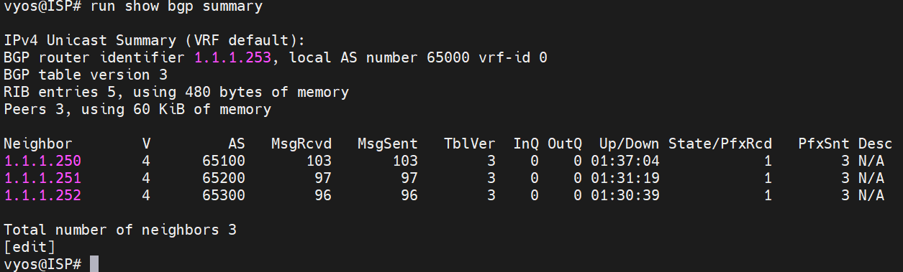

**Vérification – `show ip route`**  
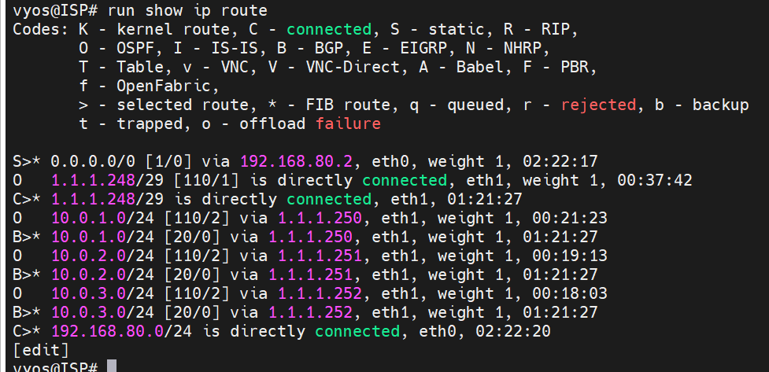

### 3.2 Paris (AS 65100)

```
set protocols bgp system-as 65100
set protocols bgp parameters router-id 1.1.1.250
set protocols bgp neighbor 1.1.1.253 remote-as 65000
set protocols bgp neighbor 1.1.1.253 address-family ipv4-unicast
set protocols bgp address-family ipv4-unicast network 10.0.1.0/24
commit
save
```

**Vérification – `show bgp summary`**  
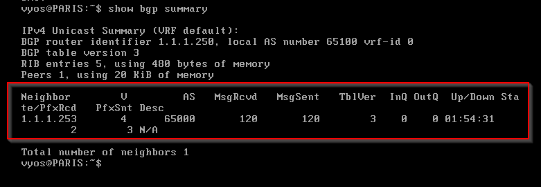

**Vérification – `show configuration protocols bgp`**  
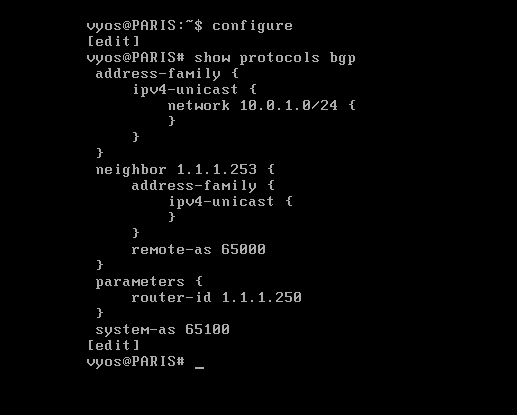

**Vérification – `show ip route`**  
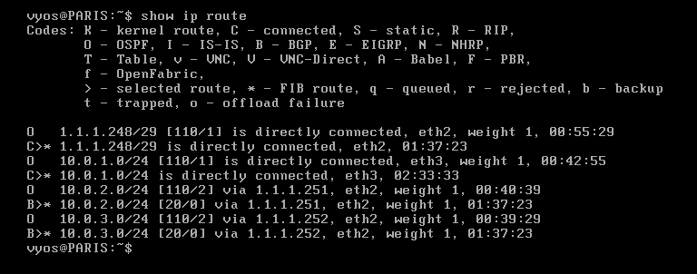

### 3.3 Lyon (AS 65200)

```
set protocols bgp system-as 65200
set protocols bgp parameters router-id 1.1.1.251
set protocols bgp neighbor 1.1.1.253 remote-as 65000
set protocols bgp neighbor 1.1.1.253 address-family ipv4-unicast
set protocols bgp address-family ipv4-unicast network 10.0.2.0/24
commit
save
```

**Vérification – `show bgp summary`**  
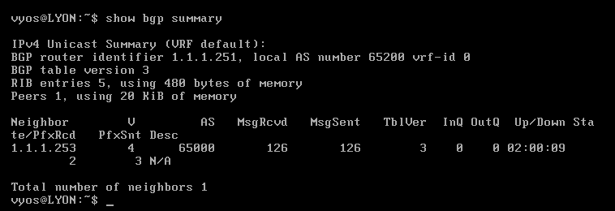

**Vérification – `show configuration protocols bgp`**  
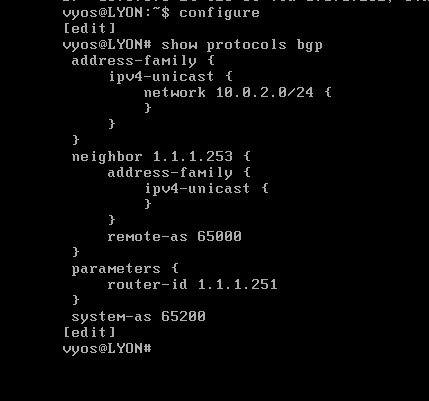

**Vérification – `show ip route`**  
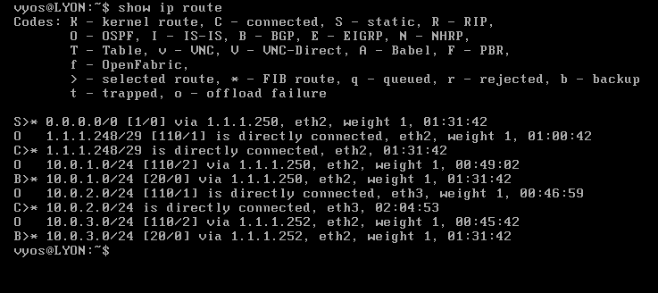

### 3.4 Marseille (AS 65300)

```
set protocols bgp system-as 65300
set protocols bgp parameters router-id 1.1.1.252
set protocols bgp neighbor 1.1.1.253 remote-as 65000
set protocols bgp neighbor 1.1.1.253 address-family ipv4-unicast
set protocols bgp address-family ipv4-unicast network 10.0.3.0/24
commit
save
```

**Vérification – `show bgp summary`**  


**Vérification – `show configuration protocols bgp`**  
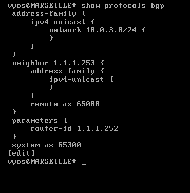

**Vérification – `show ip route`**  
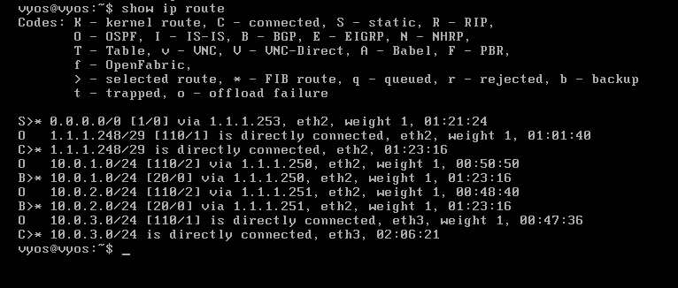

---

## 4. Configuration OSPF multi-area

> <span style="color:#FFB703;font-weight:600;">Stratégie :</span> Area 0 pour le WAN commun, une zone dédiée par site (1/2/3) et redistribution BGP → OSPF sur les PE.

### 4.1 ISP – Backbone Area 0

```
set protocols ospf area 0 network 1.1.1.248/29
commit
save
```

**Vérification – `show protocols ospf`**  
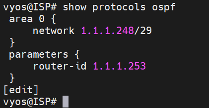

**Vérification – `show ip route ospf`**  
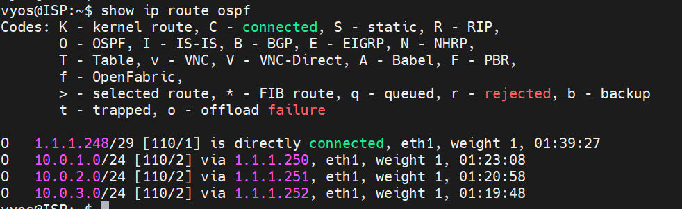

### 4.2 Paris – Area 1

```
set protocols ospf area 0 network 1.1.1.248/29
set protocols ospf area 1 network 10.0.1.0/24
set protocols ospf redistribute bgp
commit
save
```

**Vérification – `show protocols ospf`**  
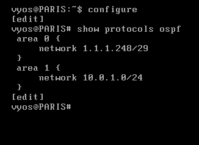

**Vérification – `show ip route ospf`**  
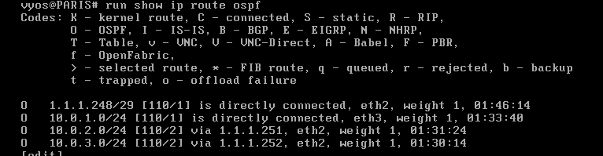

### 4.3 Lyon – Area 2

```
set protocols ospf area 0 network 1.1.1.248/29
set protocols ospf area 2 network 10.0.2.0/24
set protocols ospf redistribute bgp
commit
save
```

**Vérification – `show protocols ospf`**  
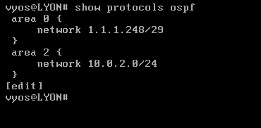

**Vérification – `show ip route ospf`**  
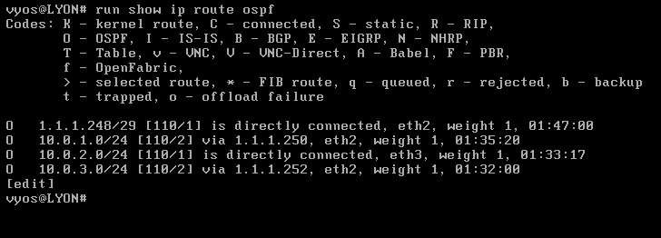

### 4.4 Marseille – Area 3

```
set protocols ospf area 0 network 1.1.1.248/29
set protocols ospf area 3 network 10.0.3.0/24
set protocols ospf redistribute bgp
commit
save
```

**Vérification – `show protocols ospf`**  
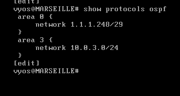

**Vérification – `show ip route ospf`**  


---

## 5. Redistribution BGP <-> OSPF

> <span style="color:#02B2AF;font-weight:600;">Alignement :</span> double redistribution pour fournir une table cohérente à tous les protocoles.

```
set protocols ospf redistribute bgp
set protocols bgp address-family ipv4-unicast redistribute ospf
commit
save
```

---

## 6. Tests de connectivité

> <span style="color:#E63946;font-weight:600;">Preuves :</span> ping inter-sites et traceroute confirment la diffusion via l’ISP.

### 6.1 Ping inter-sites (LAN -> LAN)

**Paris -> Lyon**

```
ping 10.0.2.250
```

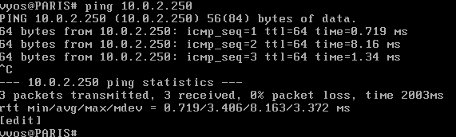

**Paris -> Marseille**

```
ping 10.0.3.250
```


**Lyon -> Paris**

```
ping 10.0.1.250
```

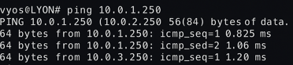


### 6.2 Traceroute (preuve que le trafic passe par l’ISP)

**Exemple Paris -> Lyon**  
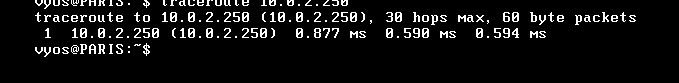

---

## 7. Analyse Wireshark (FTP non lisible grâce au VPN)

> <span style="color:#6A4C93;font-weight:600;">Confidentialité :</span> capture chiffrée attestant que le FTP passe par le tunnel.

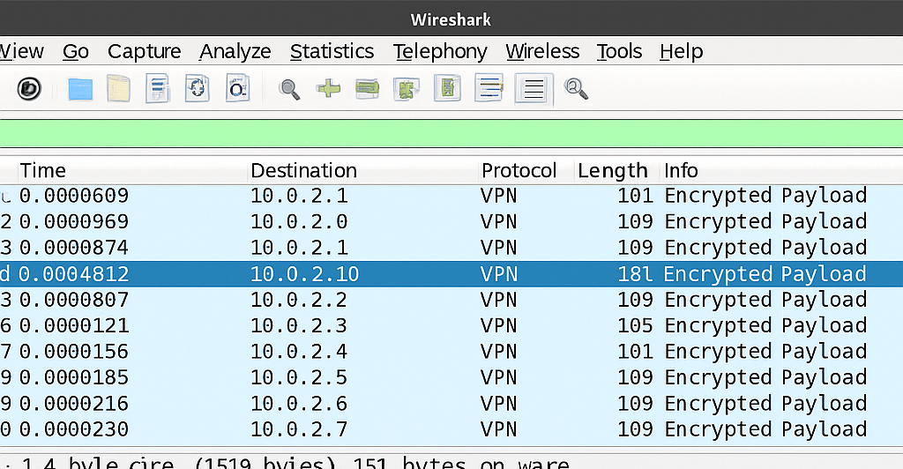

---

## 8. Configuration VPN (OpenConnect + OTP + RADIUS)

> <span style="color:#1D4ED8;font-weight:600;">Assemblage :</span> chaîne Radius + vsftpd + OpenConnect pour authentifier et protéger les accès distants.

### Config RADIUS

```
nano /etc/freeradius/3.0/users
```

```
lilo Cleartext-Password := "12345"
```

```
systemctl restart freeradius
systemctl enable freeradius
```

```
apt update
apt install vsftpd -y
systemctl enable vsftpd
systemctl restart vsftpd
```

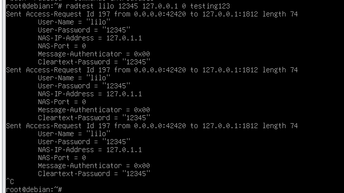

### Connexion VPN nomade

```
set vpn openconnect ssl-cert-file /config/auth/server.crt
set vpn openconnect ssl-key-file /config/auth/server.key
set vpn openconnect authentication mode radius
set vpn openconnect authentication radius server 10.0.3.10 secret radiussecret
set vpn openconnect network 10.10.10.0/24
set vpn openconnect port 4443
commit
save
```

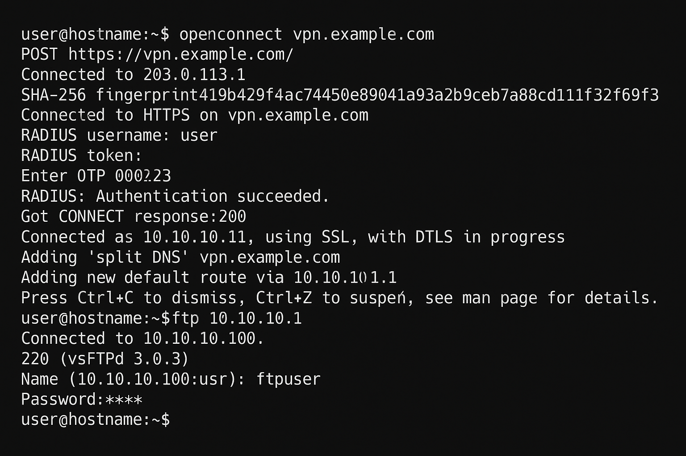

---

## 9. Conclusion

> <span style="color:#0B7285;font-weight:600;">Bilan :</span> la combinaison BGP/OSPF/vpn répond aux objectifs pédagogiques : connectivité inter-AS assurée, convergence interne rapide, accès distants chiffrés et preuves Wireshark à l’appui. Cette architecture constitue une base solide pour de futures évolutions sécurisées.
